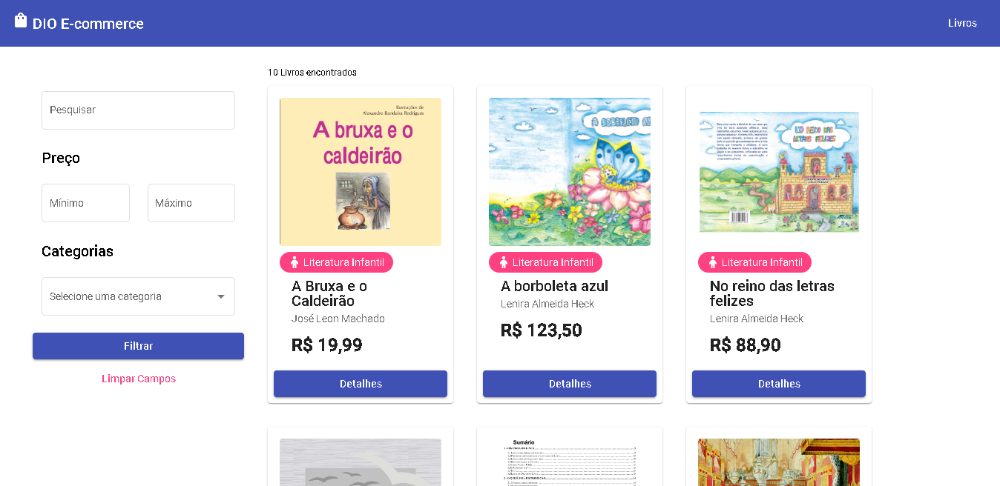
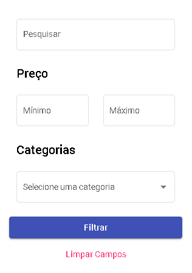

# Projeto - E-commerce com Angular


## Overview
 - [Sobre o projeto](#sobre-o-projeto)
 - [Detalhes da Implementação](#detalhes-da-implementação)
    - [API](#api)
    - [FrontEnd](#frontend)
 - [Como Usar](#como-usar)

## Sobre o projeto
O projeto é relacionado a um desafio do Bootcamp Unimed-BH Fullstack da DIO (Digital Innovation One). O desafio era desenvolver o frontend de um e-commerce utilizando angular.
Os bootcamps são propostas de projetos para que os alunos pratiquem os conteúdos ensinados nos cursos do bootcamp.

## Detalhes da implementação
### API
Para desenvolver esse projeto eu criei uma API fake que retorna dados mockados. A API foi feita utilizando express e typescript, esse último ensinado nos cursos do bootcamp. A API possui 2 endpoints: 
 - O `/books` retorna todos os livros cadastrados e é possível filtrar a consulta, utilizando um termo de pesquisa, filtrar pelo preço mínimo e máximo e pela categoria do livro. 
 - Já o `/categories` retorna todas as categorias cadastradas.

### FrontEnd
O frontend foi feito utilizando angular como pedia o desafio. Para a criação das páginas combinei o Angular Material UI (biblioteca de componentes do material design para o angular) para a criação dos componentes com o Grid System do Bootstrap para organizar e posicionar os componentes na página. <br/>
Na página de livros há um painel de filtros para realizar a busca por determinados livros, utilizando um termo de pesquisa, o preço mínimo e/ou máximo que um livro deve ter e um select com as categorias obtidas do backend. Esse painel é um componente à parte para melhorar a organização do código e os dados são passados e retornados a ele por meio de propriedades com os decorators @Input e @Output (ou seja, ele é um componente apresentacional). A página de livros (componente inteligente) é responsável por obter a lista de categorias e passar para o componente de filtros. <br />


A lista de livros é exibida por meio de um flex container (flexbox). <br/>


O frontend consome os dados da API utilizando o HttpClient do angular através de um service chamado BooksService.

## Como usar
1- Para testar localmente o projeto faça o clone do projeto
```
git clone 
```

2- Pelo terminal entre na pasta **server** e execute o servidor nodeJS
```
npm run dev
```

3- Em outro terminal, entre na pasta **frontend** e execute a aplicação angular
```
npm start
```

4- Abra o seu novegador na url `http://localhost:4200`